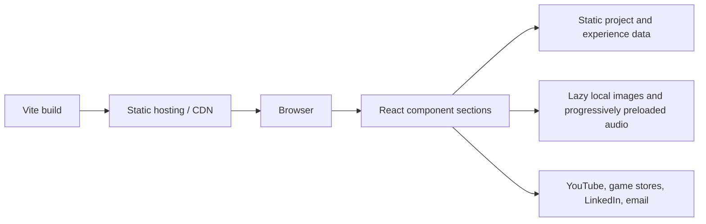

# Swapnil Sinha — Game Audio Portfolio

A static, media-first portfolio for game audio and technical sound designer Swapnil Sinha. It was built to make the work immediately reviewable: reels, shipped credits, implementation context, and playable audio live on one page without requiring an account.

- Repository: [akhil-star/swapnil-sinha-game-audio-portfolio](https://github.com/akhil-star/swapnil-sinha-game-audio-portfolio)
- Live portfolio: [swapnilsgamez.vercel.app](https://swapnilsgamez.vercel.app/)
- Local demo: run `npm ci && npm run dev`, then open `http://localhost:5173`
- Production preview: run `npm run build && npm run preview`

## Why this architecture

The portfolio is intentionally a client-only Vite + React application. Its content changes infrequently, requires no authentication, and does not collect user data. Keeping it static removes unnecessary server, database, secret-management, and rate-limiting concerns while making deployment inexpensive and reliable.

There are no serverless functions or database in the current product. If a contact form, CMS, or private analytics endpoint is added later, it should be introduced as a separate boundary with server-side validation, secret storage, and rate limiting.

## Component and state boundaries

- `App.jsx` only composes page sections and global providers.
- Content lives in `src/data/`, separate from presentation.
- Audio exclusivity, browser playback failures, and global notices live in `SoundContext`.
- Track selection, playback progress, and loading state stay inside their respective players.
- Native `<dialog>`, `<button>`, links, labels, and live regions provide keyboard and assistive-technology behavior without custom interaction emulation.
- Shared resilient media components provide loading indicators, descriptive alternatives, and external YouTube fallbacks.

## Reliability and accessibility

- YouTube videos use local posters and connect only after the visitor presses Play.
- Non-critical images lazy-load and retry transient CDN failures before showing a manual fallback.
- The active track in each player preloads opportunistically; the remaining large archive files load only when selected.
- Audio failures produce both inline status and a dismissible global notice.
- Missing images render a readable fallback instead of a broken-image icon.
- Visible focus styles, reduced-motion handling, semantic controls, descriptive image alternatives, and native dialog keyboard behavior are included.
- The production build contains no API keys, tokens, database URLs, or frontend secrets.

## Trade-offs

- Audio remains in `public/` so static hosts can serve byte ranges, but this makes the full archive part of the deployment artifact. A media CDN is the next step if bandwidth becomes significant.
- YouTube provides reliable video delivery and smaller builds at the cost of an external dependency. Every embed includes a direct YouTube fallback.
- The atmospheric background is intentionally prominent; contrast scrims protect readability while preserving detail.
- The project uses JavaScript rather than TypeScript. There are therefore no TypeScript `any` shortcuts to remove; ESLint and explicit data boundaries provide the current guardrails.

## AI-assisted work

AI assistance was used to assemble and refine component styling, transform the supplied visual reference into a portrait-free background, and audit generated residue. The final constraints were explicit: preserve authored portfolio content, remove private implementation details, keep the experience static, avoid invented backend features, and verify every change with lint, production builds, and browser previews.

## Media policy

Only compressed, published samples belong in `public/`. Lossless masters and long-form source media should remain outside the deployed site. Images are compressed, audio loads on demand, YouTube hosts the reel embeds, and the supplied Rahasya case-study demo is served as a local MP4.

| Location                    | Purpose                                                        |
| --------------------------- | -------------------------------------------------------------- |
| `src/data/site.js`          | Identity, contact information, links, tools, and approach copy |
| `src/data/projects.js`      | Shipped game credits and store links                           |
| `src/data/capturedWorks.js` | Verified YouTube reel IDs and supporting category counts       |
| `src/data/experience.js`    | Experience and education                                       |
| `public/audio/`             | Published, load-on-play audio                                  |
| `public/artwork/`           | Optimized site artwork                                         |
| `public/cursors/`           | Small theme-specific pointer assets                            |
| `public/media/`             | Project imagery, reel posters, and case-study video            |
| `public/resume/`            | Current downloadable résumé                                    |
| `public/tool-logos/`        | Local toolchain logos                                          |

## Commands

| Command                | Use                                                       |
| ---------------------- | --------------------------------------------------------- |
| `npm run dev`          | Start the local development server                        |
| `npm run lint`         | Run ESLint                                                |
| `npm run build`        | Generate the production build in `dist/`                  |
| `npm run preview`      | Serve the production build locally                        |
| `npm run format:check` | Verify formatting without changing files                  |
| `npm run fetch:media`  | Download store imagery into `public/media/` when required |
| `npm run verify:media` | Validate public folders, file signatures, and references  |
